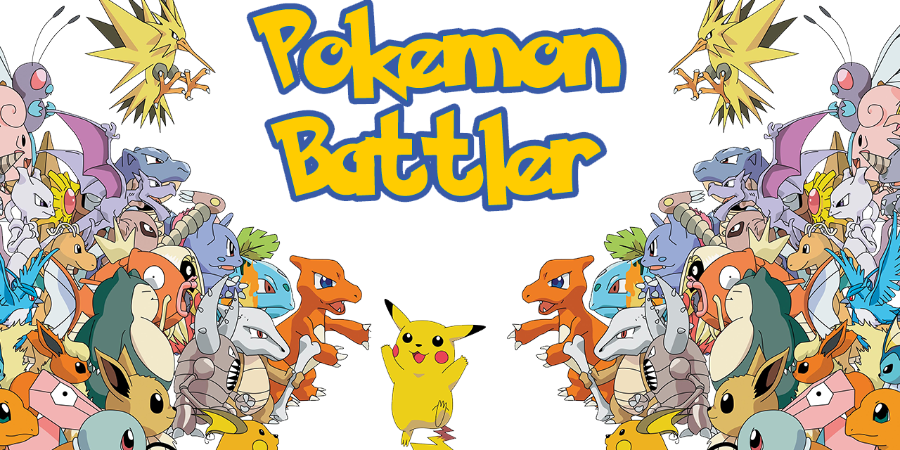

##  Pokemon Battler

[Link to project](www.water.com/)

###  Contributors:

- [Jess Schueler](https://github.com/jessgschueler)

- [Bri Chavez](https://github.com/BriChavez)

- [Jarret Jeter](https://github.com/jarretjeter)

- [Dylan Peterson](https://github.com/DyPeterson)

###  Description
Team project that creates an API out of a online TSV. The API allows you to battle with two Pokemon from dataset. After a battle is completed It updates the win/losses respectively. The dataset and API are also hosted on the cloud.

### Technologies Used:

- [Python](https://www.python.org/)
- [Pandas](https://pandas.pydata.org/)
- [Flask](https://flask.palletsprojects.com/en/2.1.x/)
- [Google BigQuery](https://cloud.google.com/bigquery)
- [Google Cloud Storage](https://cloud.google.com/storage)
- [Google App Engine](https://cloud.google.com/appengine)
- [Bootstrap](https://getbootstrap.com/)
- [WTForms](https://wtforms.readthedocs.io/en/3.0.x/#)

#### Programs used:

- [Visual Code Studio](https://code.visualstudio.com/)
- [Windows Terminal](https://apps.microsoft.com/store/detail/windows-terminal/9N0DX20HK701?hl=en-us&gl=US) (Running: [WSL2](https://docs.microsoft.com/en-us/windows/wsl/install) ([ubuntu 20.04](https://releases.ubuntu.com/20.04/)))

### Setup & Installation:

1. Through the terminal like [GitBash](https://git-scm.com/downloads) 

  
	
	1. Open the terminal and navigate to where you would like the new project to be using `cd` commands. Its also recommended that you make a new directory using `mkdir *directory-name*`.

	  

	1. Clone the repository using the command `git clone https://github.com/BriChavez/pokemon_battler.git`

	  

	1. After cloning the directory it will appear in the directory that your terminal is set to. So make sure you are in the directory that you want this project copied to.

	  

	1. Once this project is cloned you can navigate to that folder within your terminal and create a virtual environment `python3.7 -m venv *any-name*`. Now activate the venv with `source *any-name*/bin/activate`

	  

	1. Install requirements in venv `pip install -r requirements.txt`

	  

	1. Download the data from [Kaggle](https://www.kaggle.com/datasets/rounakbanik/pokemon) and place in the data directory.

	  

	1.  `code .` to open in default coding software.

  

2. Through GitHub.com

  
	
	1. Go to the project's directory page **[HERE](https://github.com/BriChavez/pokemon_battler)**

	  

	2. Click the green `code` button to open the drop-down menu.

	  

	3. At the bottom of the menu will have *Download Zip*. Go ahead and click it to download the project.

	  

	4. Once downloaded find the `.zip` file and right-click it to bring up the menu. Within that menu click `Extract Here` to extract it in the current folder or click `Extract Files...`to select which folder you would like the project in.

	  

	5. Once the project has been extracted, locate the folder in a terminal and open it with `code .` to view the code .
	
	6. Run the `main.py`  with the command `python main.py`to run the API locally
	
1. Finally you can use the website from the link provided [here](www.google.com)

#### Link to project on GitHub:
[GitHub Repository](https://github.com/BriChavez/pokemon_battler)

### Details
This project was an open-ended prompt to showcase the knowledge we have learned so far while enrolled in [Data Stack Academy](https://www.datastack.academy/). As a team we decided to use a Kaggle Pokemon dataset to host a website API that allows the user to input two different Pokemon and have them battle each other. And also update our data with a win or a loss depending on the results of the battle. This project uses a myriad of tools to help us arrive at the goal. It uses flask to host the API, Google App Engine to host our created API and Pandas to code our data edits as user inputs happen. 

### Known Bugs

 No known bugs at this time.

### Copyright 2022

Permission is hereby granted, free of charge, to any person obtaining a copy of this software and associated documentation files (the "Software"), to deal in the Software without restriction, including without limitation the rights to use, copy, modify, merge, publish, distribute, sublicense, and/or sell copies of the Software, and to permit persons to whom the Software is furnished to do so, subject to the following conditions:

  

The above copyright notice and this permission notice shall be included in all copies or substantial portions of the Software.

  

THE SOFTWARE IS PROVIDED "AS IS", WITHOUT WARRANTY OF ANY KIND, EXPRESS OR IMPLIED, INCLUDING BUT NOT LIMITED TO THE WARRANTIES OF MERCHANTABILITY, FITNESS FOR A PARTICULAR PURPOSE AND NONINFRINGEMENT. IN NO EVENT SHALL THE AUTHORS OR COPYRIGHT HOLDERS BE LIABLE FOR ANY CLAIM, DAMAGES OR OTHER LIABILITY, WHETHER IN AN ACTION OF CONTRACT, TORT OR OTHERWISE, ARISING FROM, OUT OF OR IN CONNECTION WITH THE SOFTWARE OR THE USE OR OTHER DEALINGS IN THE SOFTWARE.